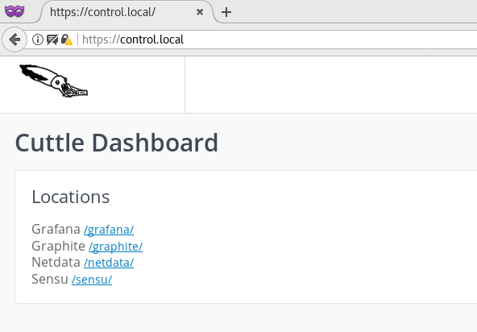
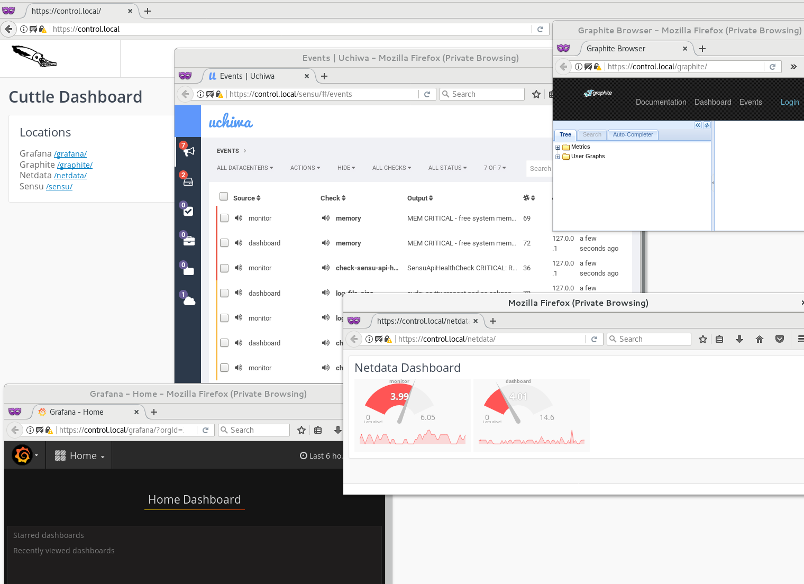

# Deploying a OAuth2 secured Monitoring Server

Alongside our 2FA secured bastion we also use a 2FA secured web dashboard/portal
to ensure that any access to any of our dashboards (in this case sensu, graphite, etc)
is authenticated in a meaningful way.

Our default 2FA method is OAuth2 to github, however OAuth2 to anywhere should work
with the correct config changes and we also support (currently not in testing matrix)
OpenID as well as good old plain basic auth (not 2fa obviously).

Anybody interacting with Cuttle systems (or systems being managed by Cuttle) should
use SSH or HTTPS thus our focus on securing Cuttle is by locking down both with 2FA
and using host based firewalls (UFW/IPTables) to restrict access to everything else.

In this deployment scenario we will deploy two servers, the first being our Monitoring
server which consists of Sensu, Uchiwa, Graphite, and Grafana.  In a real world scenario
you would break this out across multiple servers but for the example it makes sense
to keep it simple.  Our second server will be the OAuth2 secured dashboard/portal.

## Environment

You'll find the inventory for this deployment scenario in [envs/example/monitor](envs/example/monitor).
The majority of our settings are in [group_vars/all](envs/example/monitor/group_vars/all.yml)
but you may find some in [defaults.yml]([group_vars/all](envs/example/defaults.yml) or
some vagrant overrides in [vagrant.yml](envs/example/vagrant.yml).

I'll be using the `--provisioner=vagrant` option in `ursula-cli` to do the deployment
which means that Vagrant will use the file [envs/example/monitor/vagrant.yml](envs/example/monitor/vagrant.yml)
to build the VMs and [envs/example/vagrant.yml](envs/example/vagrant.yml) to load
any additional ansible variables specific to the vagrant environment.  I've tried to
keep any values dynamic so this should work on the cloud or somewhere other than
Vagrant with minimal changes.

## Architecture

This is a really bad diagram attempting to show the flows of the
Web traffic.  As well as what is shown both servers have a sensu-client
which is subscribing to the sensu-server on `monitor` via rabbitmq.

As well as providing a local dashboard, netdata is sending system metrics
to graphite. All internal communication is happening via eth2 which is
a vagrant private network and the user accesses it over eth1.

```


                       +----------------------------------------------------------------------------------------------------------------------------+
                       |                                                     Vagrant                                                                |
                       |                                                                                                                            |
                       |            +-----------------------------+                    +----------------------------------------+                   |
                       |            |           Dashboard         |                    |               Monitor                  |                   |
     XXXXXX            |            |                             |                    |                                        |                   |
     X    XX           |            |                             |                    |                                        |                   |
    XXXXXXXX           |            |   +-----------------------+ |                    |                                        |                   |
        X              |       eth1 |   |                       | |                    |                                        |                   |
XXX    X   XXX +----------------------> |   Apache SSL /        | |                    |                                        |                   |
    XX XXX             |            |   |   Reverse Proxy       | |                    +-------------+                          |                   |
      XXX              |            |   |                       | | eth2          eth2 ||            |                          |                   |
        X              |            |   +-----------------------+ +------------------->-|  Uchiwa    |                          |                   |
        X              |            |              |              ||                   ||            |                          |                   |
       XX              |            |   +----------v------------+ ||                   +-------------+    +------------------+  |                   |
     X XXX             |            |   |                       | ||                   |                  |                  |  |                   |
    X     X            |            |   |   OAuth2 Proxy        | ||                   +-------------+    |Sensu Server/API  |  |                   |
           X           |            |   |                       | ||                   ||            |    |                  |  |                   |
                       |            |   |                       | |------------------->-| Grafana    |    +------------------+  |                   |
                       |            |   +-----------------------+ ||                   ||            |                          |                   |
                       |            |              |              ||                   +-------------+    +------------------+  |                   |
                       |            |   +----------v------------+ ||                   |                  |                  |  |                   |
                       |            |   |                       | ||                   +-------------+    |  Graphite/Carbon |  |                   |
                       |            |   | Apache Reverse Proxy/ +--------------------->-|            |    |                  |  |                   |
                       |            |   | Dashboard             | ||                   || Graphite   |    +------------------+  |                   |
                       |            |   |                       | ||                   || Dashboard  |                          |                   |
                       |            |   +-----------------------+ ||                   +-------------+     +-----------------+  |                   |
                       |            |        |                    ||                   |                   |                 |  |                   |
                       |            |   +----v-----+ +---------+  ||                   +-------------+     |  Redis/RabbitMQ |  |                   |
                       |            |   |Netdata   +-> Netdata |  ||                   ||            |     |                 |  |                   |
                       |            |   |Dashboard | |         |  +------------------->-| Netdata    |     +-----------------+  |                   |
                       |            |   +----------+ +---------+  |                    ||            |                          |                   |
                       |            |                             |                    +-------------+                          |                   |
                       |            |                             |                    |                                        |                   |
                       |            |                             |                    |                                        |                   |
                       |            +-----------------------------+                    +----------------------------------------+                   |
                       +----------------------------------------------------------------------------------------------------------------------------+
```

## Deploy

### Prerequisites

You will need Vagrant and Virtualbox installed to follow the deployment guide.
If you do not wish to use them its possible to do this on any VMs or Physical
Machines, you'll just need to modify the inventory a bit and skip the
`--provisioner=vagrant` option.

The first thing is to clone this repo and prepare your environment to run ansible.
I use [virtualenvwrapper](https://virtualenvwrapper.readthedocs.io/en/latest/) to
manage my Python VirtualEnvs.  If you use a different tool or just install straight
to system Python like a boss you may need to alter some of the following commands:

```bash
$ git clone https://github.com/IBM/cuttle.git
$ cd cuttle
$ mkvirtualenv cuttle
$ workon cuttle
$ pip install -r requirements.txt
```

### Deploy

Since we'll be using OAuth2 to protect our environment you will need to set up
a github authorization for it.

Go to the [Github Register OAuth Application](https://github.com/settings/applications/new) page
where you can register a new app.  set HomePage URL to `https://control.local/` and
callback URL to `https://control.local/oauth2/callback`.  Set the provided id and secret
in `envs/example/monitor/host_vars/dashboard.yml` like so:

```yaml
apache_auth:
  oauth2:
    config:
      client_id: "XXXXXXXXXX"
      client_secret: "XXXXXXXXXXXXXXXXX"
````

You will also want to add `control.local` to your hosts file (likely `/etc/hosts`) so
that you can resolve this URL locally.

```
172.16.0.15 control.local
```

Initiate the deployment by using `ursula-cli` which has been installed into your
python environment by the above steps:

```bash
$ ursula --provisioner=vagrant envs/example/monitor site.yml
View Vagrant status at vagrant.log
Starting ['monitor', 'dashboard']
...
...
PLAY RECAP ********************************************************************
dashboard                  : ok=203  changed=140  unreachable=0    failed=0
monitor                    : ok=361  changed=252  unreachable=0    failed=0
Friday 21 July 2017  08:49:04 -0500 (0:00:00.043)       0:12:16.508 ***********
```

> Note: it may take a while here depending on the speed of your internet connection
there's a fairly large base vagrant image to download and then ansible will run and
install lots of packages on those VMs.  See [Install behind a proxy](/README.md#run-behind-a-docker-proxy-for-local-dev)
For some help speeding the install up by utilizing a proxy.

Hopefully all went well and you ended up with a completed Ansible run.  From
here you should open a web browser (I like to use a private browser to ensure I
don't get surprised by a saved session or cookie) at https://control.local/.

We have a self-signed certificate in the ansible inventory `envs/example/defaults.yml`
in the dictionary under `apache_auth.ssl` so the first thing you'll need to do
is tell the browser to make an exception for the key and then it will redirect
you to github for the OAuth process. Enter your Github credentials and it should then take
you back to the control dashboard

.

From here you can get to any of the monitoring tools we have deployed by clicking the
appropriate link:

.

You should see data appearing in all of these tools as cuttle uses the ansible
inventory to help inform each tool how to connect and report to the appropriate
place.

Any server deployed in the same inventory with sensu-client, netdata, etc enabled
will also start reporting monitoring and metrics back to the monitor server.
